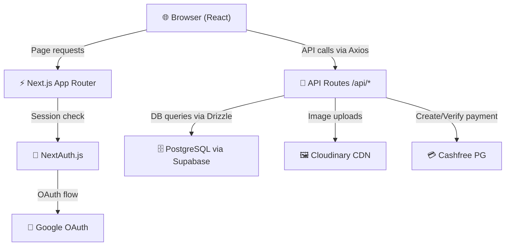
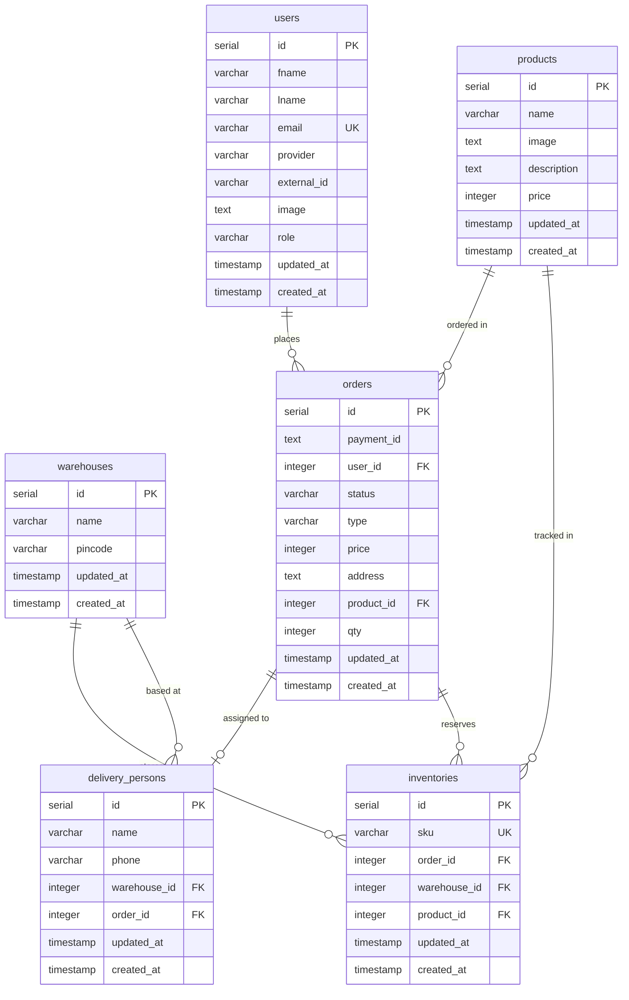

# 🚀 Quicky — Project Documentation

> A **Next.js** quick-commerce (Q-commerce) platform enabling rapid product delivery, inventory management, warehouse coordination, and integrated payments.

---

## Table of Contents

- [Overview](#overview)
- [Tech Stack](#tech-stack)
- [Architecture](#architecture)
- [Project Structure](#project-structure)
- [Database Schema](#database-schema)
- [Authentication](#authentication)
- [API Routes](#api-routes)
- [Environment Variables](#environment-variables)
- [Getting Started](#getting-started)
- [Database Management](#database-management)
- [Deployment](#deployment)

---

## Overview

**Quicky** is a quick-commerce web application built with Next.js 14. It enables customers to purchase products for rapid delivery, while admins can manage products, warehouses, inventory, delivery personnel, and orders all from a single dashboard.

### Key Features

| Feature | Description |
|---|---|
| 🔐 Google OAuth | Seamless sign-in via Google using NextAuth.js |
| 🛒 Product Ordering | Customers browse and purchase products |
| 💳 Cashfree Payments | Integrated Cashfree PG for secure payment processing |
| 🏭 Warehouse Management | Admin can manage multiple warehouses by pincode |
| 📦 Inventory Tracking | SKU-based inventory with warehouse association |
| 🚴 Delivery Management | Delivery persons assigned to orders automatically |
| 🖼️ Image Upload | Product images hosted via Cloudinary |
| 👤 Role-Based Access | `customer` and `admin` roles with protected routes |

---

## Tech Stack

### Core

| Technology | Version | Purpose |
|---|---|---|
| [Next.js](https://nextjs.org/) | 14.2.5 | Full-stack React framework (App Router) |
| [React](https://react.dev/) | 18.3.1 | UI library |
| [TypeScript](https://www.typescriptlang.org/) | 5.5.4 | Type safety |

### Backend & Database

| Technology | Version | Purpose |
|---|---|---|
| [Drizzle ORM](https://orm.drizzle.team/) | 0.33.0 | Type-safe PostgreSQL ORM |
| [postgres.js](https://github.com/porsager/postgres) | 3.4.4 | PostgreSQL driver |
| [Supabase](https://supabase.com/) | 2.45.3 | PostgreSQL hosting + storage |

### Auth & Payments

| Technology | Version | Purpose |
|---|---|---|
| [NextAuth.js](https://next-auth.js.org/) | 4.24.7 | Authentication (Google OAuth) |
| [cashfree-pg](https://www.cashfree.com/) | 4.2.3 | Payment gateway (server-side) |
| [@cashfreepayments/cashfree-js](https://www.cashfree.com/) | 1.0.5 | Payment gateway (client-side) |

### Media & State

| Technology | Version | Purpose |
|---|---|---|
| [Cloudinary](https://cloudinary.com/) | 2.4.0 | Image upload and CDN |
| [Zustand](https://zustand-demo.pmnd.rs/) | 4.5.5 | Client-side global state |
| [TanStack Query](https://tanstack.com/query) | 5.52.2 | Server state, caching, data fetching |
| [TanStack Table](https://tanstack.com/table) | 8.20.5 | Headless data tables (admin) |

### UI

| Technology | Purpose |
|---|---|
| [Tailwind CSS](https://tailwindcss.com/) v3 | Utility-first styling |
| [Radix UI](https://www.radix-ui.com/) | Accessible UI primitives (dialogs, dropdowns, etc.) |
| [Lucide React](https://lucide.dev/) | Icon library |
| [React Hook Form](https://react-hook-form.com/) + [Zod](https://zod.dev/) | Form handling and validation |
| [react-hot-toast](https://react-hot-toast.com/) | Toast notifications |
| [Axios](https://axios-http.com/) | HTTP client |

---

## Architecture



### Request Flow (Order Placement)

```mermaid
sequenceDiagram
    Customer->>+ProductPage: Select product & place order
    ProductPage->>+API/orders(POST): Submit order details
    API/orders->>+DB: Check warehouse by pincode
    API/orders->>+DB: Check inventory availability
    API/orders->>+DB: Check delivery person availability
    DB-->>-API/orders: Stock & delivery confirmed
    API/orders->>+DB: Transaction (create order, lock inventory, assign delivery person)
    DB-->>-API/orders: Order created
    API/orders-->>-ProductPage: Return order details
    ProductPage->>+Cashfree: Initiate payment (cashfree-js)
    Cashfree-->>-ProductPage: Payment session token
    ProductPage->>+API/verify-payment: Verify payment status
    API/verify-payment->>+Cashfree: Check payment
    Cashfree-->>-API/verify-payment: Payment result
    API/verify-payment-->>-ProductPage: Payment confirmed ✅
```

---

## Project Structure

```
quicky/
├── drizzle/                    # Auto-generated SQL migration files
├── src/
│   ├── app/
│   │   ├── (client)/           # Customer-facing pages (route group, no layout prefix)
│   │   │   ├── page.tsx        # Home/landing page
│   │   │   ├── product/[id]/   # Product detail + order placement page
│   │   │   ├── account/        # Customer account / order history
│   │   │   ├── delivery/       # Delivery status page
│   │   │   ├── payment/        # Payment result page
│   │   │   ├── ContactUs/      # Contact Us page
│   │   │   ├── TermsandConditions/
│   │   │   ├── RefundandCancellation/
│   │   │   └── _components/    # Shared client-side components
│   │   ├── admin/              # Admin dashboard (protected: admin role only)
│   │   │   ├── page.tsx        # Admin overview / dashboard
│   │   │   ├── layout.tsx      # Admin layout with sidebar
│   │   │   ├── products/       # Product CRUD
│   │   │   ├── warehouses/     # Warehouse management
│   │   │   ├── inventories/    # Inventory management
│   │   │   ├── delivery-persons/ # Delivery personnel management
│   │   │   ├── orders/         # Order management
│   │   │   └── _components/    # Admin-specific components
│   │   ├── api/                # Next.js API routes
│   │   │   ├── auth/[...nextauth]/ # NextAuth.js handler
│   │   │   ├── orders/         # GET (create Cashfree order), POST (place order)
│   │   │   ├── products/       # GET, POST (with Cloudinary upload)
│   │   │   ├── products/[id]/  # GET, PUT, DELETE specific product
│   │   │   ├── verify-payment/ # GET (verify Cashfree payment)
│   │   │   ├── warehouses/     # Warehouse CRUD
│   │   │   ├── inventories/    # Inventory CRUD
│   │   │   ├── delivery-persons/ # Delivery person CRUD
│   │   │   └── all-orders/     # Admin: fetch all orders
│   │   ├── globals.css         # Global styles
│   │   └── layout.tsx          # Root layout (providers, fonts)
│   ├── components/             # Reusable UI components (shadcn-style)
│   ├── http/
│   │   └── client.ts           # Pre-configured Axios instance
│   ├── lib/
│   │   ├── auth/
│   │   │   └── authOptions.ts  # NextAuth configuration
│   │   ├── db/
│   │   │   ├── db.ts           # Drizzle DB connection
│   │   │   └── schema.ts       # PostgreSQL table definitions
│   │   ├── validators/         # Zod validation schemas
│   │   ├── supabase.ts         # Supabase client
│   │   └── utils.ts            # Utility helpers (cn, etc.)
│   ├── providers/              # React context providers (TanStack Query, etc.)
│   ├── store/                  # Zustand global state stores
│   ├── types/                  # TypeScript type definitions
│   └── middleware.ts           # Route protection middleware
├── .env                        # Environment variables (gitignored)
├── drizzle.config.ts           # Drizzle Kit configuration
├── migrate.ts                  # Migration runner script
├── next.config.mjs             # Next.js configuration
├── tailwind.config.ts          # Tailwind CSS configuration
└── package.json
```

---

## Database Schema

All tables use PostgreSQL via Drizzle ORM. The schema lives in [schema.ts](file:///Users/mucool/Desktop/codes/quicky/src/lib/db/schema.ts).



### Order Status Flow

```
received → reserved → [payment verified] → delivered
```

### User Roles

| Role | Access |
|---|---|
| `customer` | `/account/*` routes |
| `admin` | `/admin/*` routes + `/account/*` routes |

---

## Authentication

Authentication is handled by **NextAuth.js v4** with **Google OAuth** provider.

### How it works

1. User clicks "Sign in with Google"
2. Google OAuth redirects back with a profile
3. `authOptions.ts` **upserts** the user into the `users` table
4. The user's `role` (from DB) is embedded into the JWT token
5. The `middleware.ts` checks the token role to protect routes

### Protected Routes (middleware.ts)

| Route Pattern | Required Role |
|---|---|
| `/admin/**` | `admin` |
| `/account/**` | `customer` or `admin` |

---

## API Routes

### Authentication
| Method | Route | Description |
|---|---|---|
| ANY | `/api/auth/[...nextauth]` | NextAuth.js handler (sign in, sign out, session) |

### Products
| Method | Route | Auth | Description |
|---|---|---|---|
| GET | `/api/products` | - | Fetch all products |
| POST | `/api/products` | Admin | Create product (with Cloudinary image upload) |
| GET | `/api/products/[id]` | - | Fetch single product |
| PUT | `/api/products/[id]` | Admin | Update product |
| DELETE | `/api/products/[id]` | Admin | Delete product |

### Orders
| Method | Route | Auth | Description |
|---|---|---|---|
| GET | `/api/orders?order_id=&order_amount=` | Session | Create a Cashfree payment order |
| POST | `/api/orders` | Session | Place an order (runs DB transaction: validates stock, assigns delivery person) |
| GET | `/api/all-orders` | Admin | Fetch all orders |

### Verify Payment
| Method | Route | Auth | Description |
|---|---|---|---|
| GET | `/api/verify-payment?payment_OrderId=&orderId=` | Session | Verify Cashfree payment status |

### Warehouses
| Method | Route | Auth | Description |
|---|---|---|---|
| GET | `/api/warehouses` | - | Fetch all warehouses |
| POST | `/api/warehouses` | Admin | Create warehouse |

### Inventories
| Method | Route | Auth | Description |
|---|---|---|---|
| GET | `/api/inventories` | Admin | Fetch all inventory items |
| POST | `/api/inventories` | Admin | Add inventory item |

### Delivery Persons
| Method | Route | Auth | Description |
|---|---|---|---|
| GET | `/api/delivery-persons` | Admin | Fetch all delivery persons |
| POST | `/api/delivery-persons` | Admin | Add delivery person |

---

## Environment Variables

All required environment variables are listed in [.env](file:///Users/mucool/Desktop/codes/quicky/.env).

| Variable | Required | Description |
|---|---|---|
| `DATABASE_URL` | ✅ | PostgreSQL connection string |
| `NEXTAUTH_SECRET` | ✅ | Secret for JWT signing (generate with `openssl rand -base64 32`) |
| `NEXTAUTH_URL` | ✅ | Base URL of the app (e.g., `http://localhost:3000`) |
| `GOOGLE_CLIENT_ID` | ✅ | Google OAuth Client ID |
| `GOOGLE_CLIENT_SECRET` | ✅ | Google OAuth Client Secret |
| `NEXT_PUBLIC_SUPABASE_URL` | ✅ | Supabase project URL |
| `NEXT_PUBLIC_SUPABASE_ANON_KEY` | ✅ | Supabase anonymous/public key |
| `CLOUDINARY_CLOUD_NAME` | ✅ | Cloudinary cloud name |
| `CLOUDINARY_API_KEY` | ✅ | Cloudinary API key |
| `CLOUDINARY_API_SECRET` | ✅ | Cloudinary API secret |
| `CASHFREE_APP_ID` | ✅ | Cashfree application ID |
| `CASHFREE_SECRET_KEY` | ✅ | Cashfree secret key |
| `NEXT_PUBLIC_BACKEND_URL` | ✅ | Base URL for API (e.g., `http://localhost:3000/api`) |

> [!NOTE]
> Variables prefixed with `NEXT_PUBLIC_` are exposed to the browser bundle. Never put sensitive secrets (like `CASHFREE_SECRET_KEY`) in `NEXT_PUBLIC_` variables.

> [!WARNING]
> The app currently uses `Cashfree.Environment.PRODUCTION` (see `orders/route.ts` line 20). Switch to `SANDBOX` for local development.

---

## Getting Started

### Prerequisites

- Node.js 18+
- A PostgreSQL database (Supabase recommended)
- Google Cloud Console project with OAuth 2.0 credentials
- Cashfree developer account
- Cloudinary account

### Installation

```bash
# 1. Clone the repository
git clone <repo-url>
cd quicky

# 2. Install dependencies
npm install

# 3. Set up environment variables
cp .env .env.local
# Then fill in your actual values in .env.local

# 4. Generate and run database migrations
npm run db:generate   # Generate SQL migration files
npm run db:run        # Apply migrations to your database

# 5. Start the development server
npm run dev
```

Open [http://localhost:3000](http://localhost:3000) in your browser.

---

## Database Management

| Command | Description |
|---|---|
| `npm run db:generate` | Generate new migration files from schema changes |
| `npm run db:run` | Apply pending migrations to the database |
| `npm run db:drop` | Drop the last migration |

> [!IMPORTANT]
> After modifying [schema.ts](file:///Users/mucool/Desktop/codes/quicky/src/lib/db/schema.ts), always run `npm run db:generate` then `npm run db:run` to keep your DB in sync.

---

## Deployment

### Vercel (Recommended)

1. Push to GitHub
2. Import project in [Vercel Dashboard](https://vercel.com/new)
3. Add all environment variables from the `.env` file in the Vercel project settings
4. Deploy!

> [!CAUTION]
> Make sure to set `NEXTAUTH_URL` to your production domain (e.g., `https://quicky.vercel.app`) and update your Google OAuth **Authorized redirect URIs** to `https://yourdomain.com/api/auth/callback/google`.
